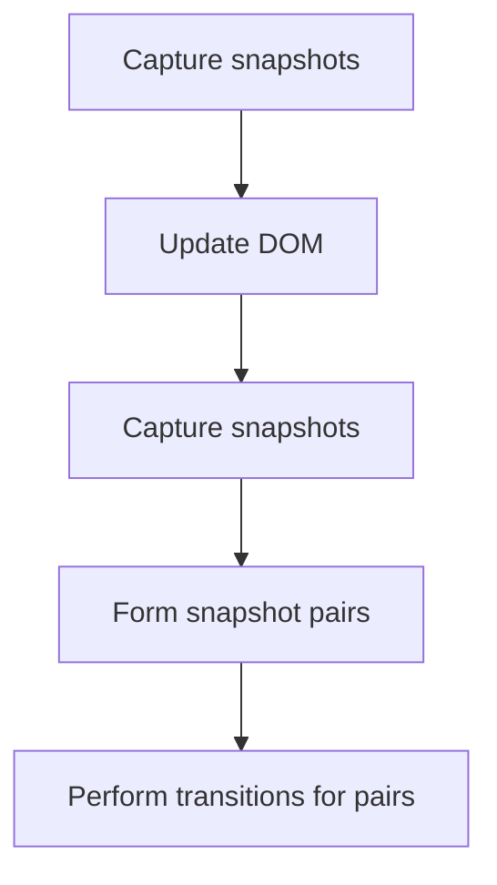

# Concept

Idea behind React Smooth Flow is very similar to [View Transition API](https://developer.mozilla.org/en-US/docs/Web/API/View_Transition_API). Elements that will be animated using the library should have unique identifier called `Tag`. Transitions perform by updating DOM in some way and capturing snapshots of targets before and after the update. Let's call snapshot captured before the updated `prev` and snapshot captured after the update `next`. When performing transition via `startTransition` snapshot pairs get created. Each pair contain at least one snapshot: `prev` and/or `next`. Pair also determines transition type, there are two: `mutation` and `presence` (enter/exit). Transition type of a pair depends on whether both snapshots were captured. For example, if we could capture both snapshots, that means that we have to perform `mutation` transition. If we were able to only capture `prev` snapshot, that means that we have to perform `presence` (exit in this case) transition. DOM updates instantly, and visible transition performs on copies of original elements that were recreated by captured snapshots.

## How is works?



# API Reference

## constructTransition

`constructTransition` is used to specify transition options by multiple tags.

### Type declaration

```ts
declare const constructTransition: (mapping: TransitionMapping) => {
  'data-transition': string;
};

type TransitionMapping = Record<Tag, TransitionOptions>;

type Tag = string;

interface TransitionOptions {
  duration?: number;
  easing?: string;
  delay?: number;
  ignoreReducedMotion?: boolean;
  enterKeyframes?: Keyframes;
  exitKeyframes?: Keyframes | 'reversedEnter';
  contentEnterKeyframes?: Keyframes;
  contentExitKeyframes?: Keyframes | 'reversedEnter';
  contentAlign?: ContentAlign;
  positionAnchor?: PositionAnchor;
  forcePresenceTransition?: boolean;
  transitionRootTag?: Tag;
  overflow?: ImageOverflow;
  relevantStyleProperties?: RelevantStyleProperties;
  persistBounds?: boolean;
  disabled?: boolean;
}

type Keyframes = Keyframe[] | PropertyIndexedKeyframes;

interface Keyframe {
  offset?: number;
  [key: string]: string | number | undefined;
}

interface PropertyIndexedKeyframes {
  offset?: number[];
  [key: string]: string[] | number[] | undefined;
}

type ContentAlign =
  | 'topLeft'
  | 'topCenter'
  | 'topRight'
  | 'centerRight'
  | 'bottomRight'
  | 'bottomCenter'
  | 'bottomLeft'
  | 'centerLeft'
  | 'center';

type PositionAnchor = 'topLeft' | 'topRight' | 'bottomRight' | 'bottomLeft';

type ImageOverflow = 'hidden' | 'visible';

type RelevantStyleProperties = Exclude<keyof CSS.PropertiesHyphen, 'pointer-events'>[];
```

### Usage

```tsx
<div
  {...constructTransition({
    tagA: {
      duration: 400,
      enterKeyframes: {
        transform: ['translateX(-250px)', 'translateX(0)'],
        opacity: [0, 1],
      },
      exitKeyframes: [
        {
          transform: 'translateX(0)',
          opacity: 1,
        },
        {
          transform: 'translateX(250px)',
          opacity: 0,
        },
      ],
    },

    tagB: {
      duration: 1200,
      enterKeyframes: { transform: ['scale(0)', 'scale(1)'] },
      exitKeyframes: 'reversedEnter',
    },
  })}
/>
```

### `TransitionOptions` options

#### `duration`

Default: `300`

Transition duration in ms.

#### `easing`

Default: `'ease'`

Transition easing function. [<easing-function\>](https://developer.mozilla.org/en-US/docs/Web/CSS/easing-function)

#### `delay`

Default: `0`

Transition start delay in ms.

#### `ignoreReducedMotion`

Default: `false`

Whether a transition should be played regardless of [prefers-reduced-motion](https://developer.mozilla.org/en-US/docs/Web/CSS/@media/prefers-reduced-motion).

#### `enterKeyframes`

Default: `{ opacity: [0, 1] }`

DOM enter animation keyframes. [Keyframe Formats](https://developer.mozilla.org/en-US/docs/Web/API/Web_Animations_API/Keyframe_Formats)

#### `exitKeyframes`

Default: `{ opacity: [1, 0] }`

DOM exit animation keyframes. [Keyframe Formats](https://developer.mozilla.org/en-US/docs/Web/API/Web_Animations_API/Keyframe_Formats)

#### `contentEnterKeyframes`

Default: `{ opacity: [0, 1, 1] }`

Mutation transition new content enter animation keyframes. [Keyframe Formats](https://developer.mozilla.org/en-US/docs/Web/API/Web_Animations_API/Keyframe_Formats)

#### `contentExitKeyframes`

Default: `{ opacity: [1, 1, 0] }`

Mutation transition old content exit animation keyframes. [Keyframe Formats](https://developer.mozilla.org/en-US/docs/Web/API/Web_Animations_API/Keyframe_Formats)

#### `contentAlign`

Default: `'topLeft'`

Snapshot content alignment.

#### `positionAnchor`

Default: `'topLeft'`

Snapshot position anchor.

#### `forcePresenceTransition`

Default: `false`

Whether `presence` transition should be played instead of `mutation`.

#### `transitionRootTag`

Default: `null`

Determines custom transition root by tag instead of screen-wide overlay root.

#### `overflow`

Default: `hidden`

Snapshot content overflow.

#### `relevantStyleProperties`

Default: `[]`

Additional style properties to capture and apply to snapshot content.

#### `persistBounds`

Default: `true`

Determines whether to capture bounds of pre-DOM update snapshot from active mutation transition snapshot, if possible. (Mutation transition only)

#### `disabled`

Default: `false`

Whether snapshot should not be captured.

## constructTransitionRoot

`constructTransitionRoot` is used to specify custom transition root. By default all transitions perform on screen-wide overlay root to make sure cross-container transitions look valid even with `overflow` property set to something other than `visible` on parent containers. But in some cases you may want to intentionally restrict visibility of an element while transitioning. Or you may want your transitioning element to tolerate complex-moving element, like with `position: sticky` or `translate` animation running on it.

### Type declaration

```ts
declare const constructTransitionRoot: (tag: Tag) => {
  'data-transitionroot': string;
};

type Tag = string;
```

### Usage

```html
<div {...constructTransitionRoot('rootTagA')} style={{ overflow: 'hidden' }}>
  <div
    {...constructTransition({
      tagA: {
        transitionRootTag: 'rootTagA',
      },
    })}
  />
</div>
```

## startTransition

`startTransition` is used to update DOM and perform transitions for elements by specified tags.

### Type declaration

```ts
declare const startTransition: (
  tags: FalsyArray<Tag>,
  updateDOM?: () => void,
  config?: TransitionConfig
) => Promise<void>;

type FalsyArray<T> = (T | Falsy)[];

type Falsy = false | 0 | '' | null | undefined;

interface TransitionConfig {
  flushSync?: boolean;
  onBegin?(): void;
  onCancel?(): void;
  onFinish?(): void;
}
```

### Usage

```ts
startTransition(['tagA', 'tagB'], () => setState(newStateValue));

startTransition(
  ['tagC'],
  () => {
    flushSync(() => setState(newStateValue));
  },
  { flushSync: false }
);
```

> [!IMPORTANT]
> Order of the provided tags represents the order of corresponding snapshots in the DOM. It may be crucial in some cases, when transitioning elements intersect with each other and you want them to be ordered correctly.

### `TransitionConfig` options

#### `flushSync`

Default: `true`

Whether `updateDOM` callback should be wrapped with [flushSync](https://react.dev/reference/react-dom/flushSync). By default `updateDOM` callback is wrapped with [flushSync](https://react.dev/reference/react-dom/flushSync) as `setState` is asynchronous, but library requires instant DOM updates between snapshot capturing steps.

#### `onBegin`

Default: `undefined`

Fires before transitions begin.

#### `onCancel`

Default: `undefined`

Fires at first transition interruption.

#### `onFinish`

Default: `undefined`

Fires if all transitions finished successfully.

## cancelTransition

`cancelTransition` is used to cancel transitions by specified tags.

### Type declaration

```ts
declare const cancelTransition: (...tags: FalsyArray<Tag>) => void;

type FalsyArray<T> = (T | Falsy)[];

type Falsy = false | 0 | '' | null | undefined;

type Tag = string;
```

### Usage

```ts
cancelTransition('tagA', 'tagB');
```

## `defaults`

`defaults` is used to configure default library options.

### Type declaration

```ts
declare const defaults: ConfigurableDefaults;

interface ConfigurableDefaults {
  defaultTransitionOptions: ParsedTransitionOptions;
}

type ParsedTransitionOptions = Required<
  Omit<TransitionOptions, 'exitKeyframes' | 'contentExitKeyframes' | 'transitionRootTag'>
> & {
  exitKeyframes: Keyframes;
  contentExitKeyframes: Keyframes;
  transitionRootTag: Tag | null;
};

type Keyframes = Keyframe[] | PropertyIndexedKeyframes;

interface Keyframe {
  offset?: number;
  [key: string]: string | number | undefined;
}

interface PropertyIndexedKeyframes {
  offset?: number[];
  [key: string]: string[] | number[] | undefined;
}

type Tag = string;

interface TransitionOptions {
  duration?: number;
  easing?: string;
  delay?: number;
  ignoreReducedMotion?: boolean;
  enterKeyframes?: Keyframes;
  exitKeyframes?: Keyframes | 'reversedEnter';
  contentEnterKeyframes?: Keyframes;
  contentExitKeyframes?: Keyframes | 'reversedEnter';
  contentAlign?: ContentAlign;
  positionAnchor?: PositionAnchor;
  forcePresenceTransition?: boolean;
  transitionRootTag?: Tag;
  overflow?: ImageOverflow;
  relevantStyleProperties?: RelevantStyleProperties;
  persistBounds?: boolean;
  disabled?: boolean;
}

type ContentAlign =
  | 'topLeft'
  | 'topCenter'
  | 'topRight'
  | 'centerRight'
  | 'bottomRight'
  | 'bottomCenter'
  | 'bottomLeft'
  | 'centerLeft'
  | 'center';

type PositionAnchor = 'topLeft' | 'topRight' | 'bottomRight' | 'bottomLeft';

type ImageOverflow = 'hidden' | 'visible';

type RelevantStyleProperties = Exclude<keyof CSS.PropertiesHyphen, 'pointer-events'>[];
```

### Default values

```ts
const defaults: ConfigurableDefaults = {
  defaultTransitionOptions: {
    duration: 300,
    easing: 'ease',
    delay: 0,
    ignoreReducedMotion: false,
    enterKeyframes: { opacity: [0, 1] },
    exitKeyframes: { opacity: [1, 0] },
    contentEnterKeyframes: { opacity: [0, 1, 1] },
    contentExitKeyframes: { opacity: [1, 1, 0] },
    contentAlign: 'topLeft',
    positionAnchor: 'topLeft',
    forcePresenceTransition: false,
    transitionRootTag: null,
    overflow: 'hidden',
    relevantStyleProperties: [],
    persistBounds: true,
    disabled: false,
  },
};
```

### Usage

```ts
import { defaults } from 'react-smooth-flow';

defaults.defaultTransitionOptions.duration = 600;
defaults.defaultTransitionOptions.easing = 'linear';
defaults.defaultTransitionOptions.ignoreReducedMotion = true;
```

## usePreCommitEffect

`usePreCommitEffect` is a hook similar to [useEffect](https://react.dev/reference/react/useEffect). It is not recommended to use this hook as it has less control over transition flow. Callback gets executed before react [commit](https://react.dev/learn/render-and-commit) stage, which allows us to use it for snapshot capturing as DOM it not updated yet. Callback also accepts boolean argument which represent wether it is first render.

### Type declaration

```ts
declare const usePreCommitEffect: (
  effect: (isInitialRender: boolean) => void | (() => void),
  deps?: React.DependencyList
) => void;
```

### Usage

```ts
const [state, setState] = useState(someState);

usePreCommitEffect(
  (isInitialRender) => {
    if (!isInitialRender) {
      startTransition(['tagA']);
    }
  },
  [state]
);

return (
  <div {...constructTransition({ tagA: {} })} onClick={() => setState(someNewStateValue)}>
    {state}
  </div>
);

// INSTEAD OF

const [state, setState] = useState(someState);

return (
  <div
    {...constructTransition({ tagA: {} })}
    onClick={() => startTransition(['tagA'], () => setState(someNewStateValue))}
  >
    {state}
  </div>
);
```
